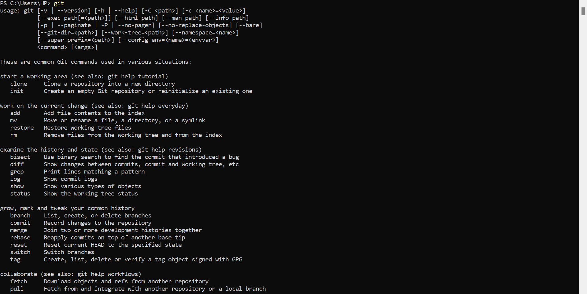
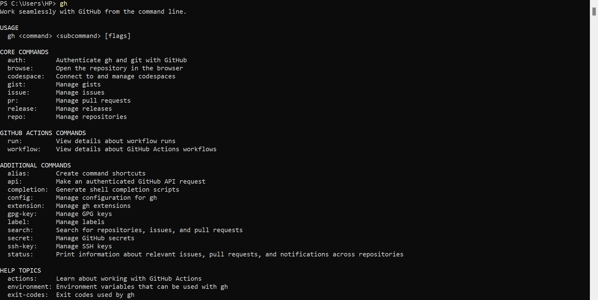
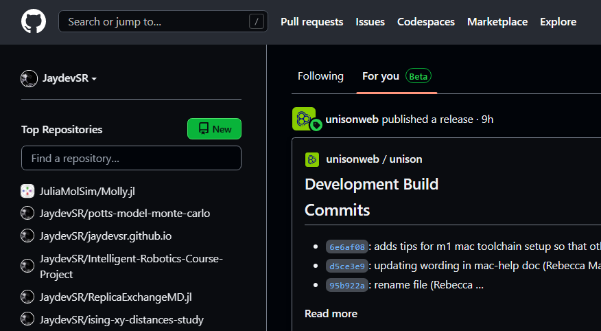
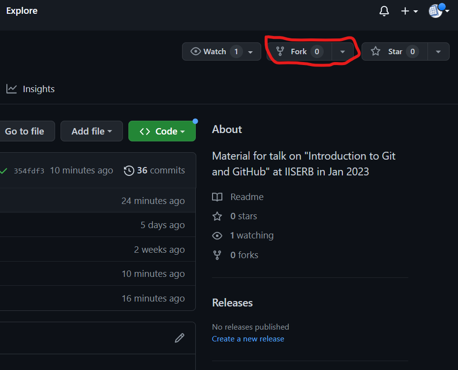
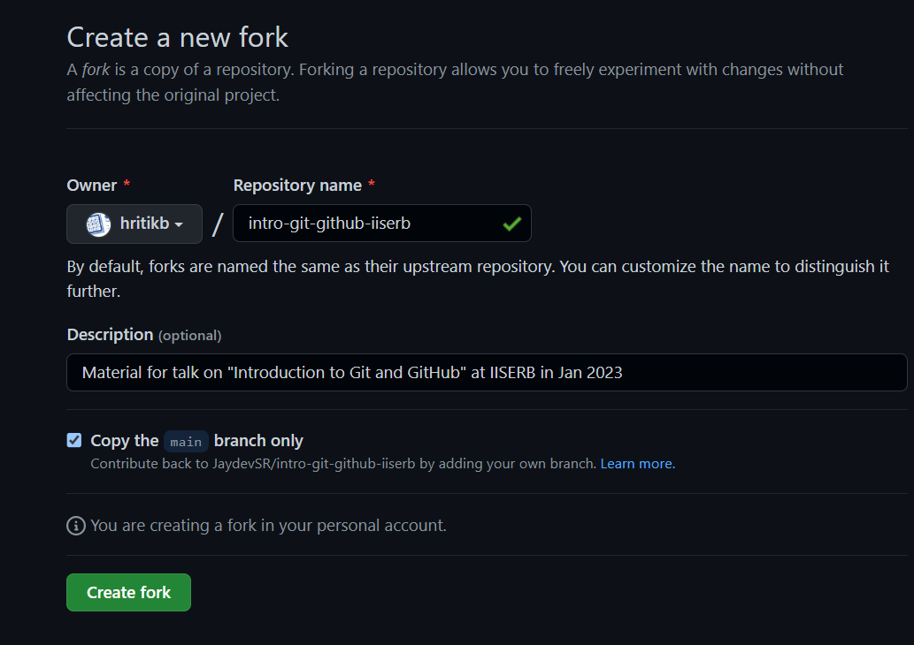
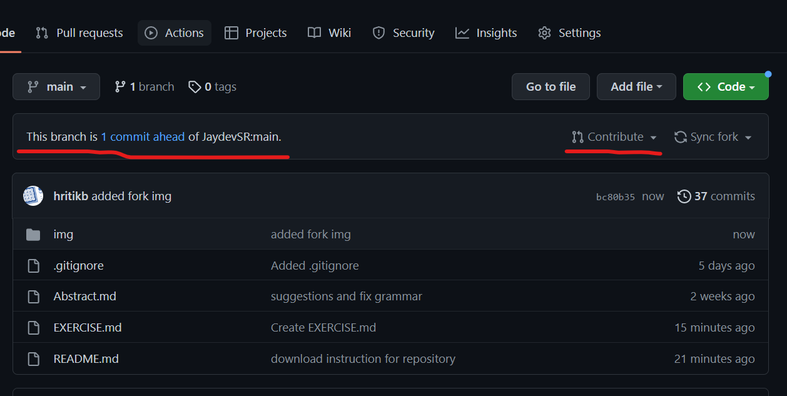

# Introduction to Git and GitHub for Project Management and Open Source Development

**[Link to GitHub repository](https://github.com/JaydevSR/intro-git-github-iiserb)**

## First steps
1. Download git for your respective Operating system by following the corresponding instructions:<br>
    ### For Linux
    If you’re on Fedora (or any closely-related RPM-based distribution, such as RHEL or CentOS), open terminal and run
    ```
    sudo dnf install git-all
    ```
    If you’re on a Debian-based distribution, such as Ubuntu, try apt:
    ```
    sudo apt install git-all
    ```
    In case you face any issues you can refer to this [page](https://git-scm.com/download/linux) for step by step procedure

    ### For Windows
    Follow this [link](https://git-scm.com/download/win) and download the installer for the version compatible for your pc. Then open the installer to complete the installation process

    ### For Mac
    PCs with mac usually come with git already installed. You can try the following command in the terminal
    ```
    git --version
    ```
    and if git is not already installed, it will prompt you to install it.

2. Once you complete the first step, run the following command on the terminal
    ```
    git
    ```
    and you should see a prompt like the one shown below
    
    If this is not the case, then follow the instructions on official [git page](https://git-scm.com/book/en/v2/Getting-Started-Installing-Git) for downloading and installing git.

3. Next, create a new GitHub account by visiting [this page](https://github.com/join).

4. Download GitHub CLI by following the instructions from this [page](https://github.com/cli/cli).

5. Try running the following command
    ```
    gh
    ```
    You should see a prompt like this
    

6. In the command line, authenticate to GitHub.
    ```
    gh auth login
    ```
    Now you are ready to start using git and GitHub from the Terminal!

## What is version control?
*The practive of keeping a timeline or history of all the changes in a software project is known as “version control”.* Git is simply the most popular software that is used for version control and that the reason everyone planning to contribute to open source projects is expected to have decent knowledge of how this tool works.

## Creating a Git Project
A git project is just a directory with a speacial `.git/` folder. This folder contains all the information about the history of your project and how its current state was reached. To make any folder a git project simply move to the folder and run (in terminal): `git init`, which tells git to creat the `.git/` folder for you. 

Let’s take an example to follow along. Imagine you are a ‘soon to be famous’ chef specializing in making revolutionary (or rather anarchaic) dishes. You decide to keep track of all your genius ideas as git project. So, for this follow the following steps:

1. Create a folder to keep all the dishes: `mkdir disasterous_dishes`
2. Move to the folder: `cd disasterous_dishes`
3. Convert this folder to a git repository to keep track of your adventures (for historians): `git init`

That’s it! Now you have converted the simple folder into a superpowered time-machine.

## Adding Files to your project

Now let’s create our first recipe! This is to learn how to keep track of file changes using git. It is usually a good idea to organize files in sub-directories so that it is easier to keep track of things.

1. Make a directory to all the recipes ‘sans-pan’ (i.e. without a pan): `mkdir sans_pan`
2. Move to the subdirectory: `cd sans_pan`
3. Create a new file using your favorite text editor, named `sunny_omelette.txt` to record our novel recipe:
    
    ```
    Ingredients:
    - 1 Egg
    - 1 magnifying glass
    - 1 sun (preferably close enough to feel warm)
    
    Steps:
    - Break the egg on the floor under the sun
    - Focus the sunlight on the eggs content using the magnifying glass
    - Wait for it to cook!
    - After some time you'll have a sunny side up (theoretically) using the sun
    ```
    
4. Now once you have this file added: `cd ..` and then `git status`. You’ll see that git tells you there are some new changes. Once sure about these changes you can ‘stage’ these changes for adding to history.
5. To stage these changes write `git add sunny_omelette.txt` . Like this you can add multiple files that you have **created** or **modified** to finalize or ‘commit’.
6. Once all the changes that you want to make are staged, you can commit these which just means recording these as a *savepoint* that you can refer back to or return back to. To do this type: `git commit -m "add sunny side up recipe"`. The string that comes after `-m` is a descriptive message that you can use to record what these changes are for.
7. Now when you type `git log` you can see that your last commit was recorded in the projects history.

**Overall the workflow consists of the following steps:**

1. Make Changes (using text editor)
2. Stage Changes (`git add ...` )
3. Commit Changes (`git commit -m “...”` )

These are the steps that are almost always followed while working on a git project!

## Reverting mistakes

So you have been doing well with your recipe, and you think of taking it a step ahead by trying out something ‘innovative’. You somehow out of nowhere think that maybe adding `sugar` to `sunny_omelette.txt` would get you to your ‘Rising Star Chef of the Year’ award. You make the change in the recipe save it.

At this point when you were about to commit it, one of your chemistry major friends brags his knowledge of chemical reactions and tells you that:

> It is not wise to add sugar to the egg because by doing this the amino acid present in both components is released, and it becomes toxic for the human body as it leads to the formation of clots in the blood.
> 

You promptly thank your friend and start hitting `ctrl + z` repeatedly to arrive at the point where you began. Well, this is not needed, as git has many better ways of helping you out. You can use `git checkout -- <filename>` or `git restore <filename>` and arrive at the most recent version previously known to Git in the commit history.

If you would have staged this file after saving then to unstage it you could have used `git restore --staged <filename>`. 

Even if you would have committed these changes you still could have reverted by using `git revert <commit>`. If you pass `HEAD` in `<commit>`, then it will create a new commit that will undo the changes made in the latest commit.

Suppose you identified this mistake after several commits then you can use `git reset <wanted SHA version>` to rewind the repository’s history to the chosen SHA version, so commits made after it are no longer applied. The SHA version can be found using `git log` where you can just use the first six characters of the really long unique id.

Sometimes you may want to just visit and see the stage of a file a an earlier point in the commit history. This can be done with the help of `git checkout <SHA version>`, and this will take the `HEAD` to the commit with the specified SHA version.

## Branching and Merging

It is not always a good idea to experiment with the recipe you have and reverting back when you later encounter that the results yielded by your experiment are not desirable. Alternatively, you may sometimes want to experiment two different additions in the recipe in parallel. Branching can help in these and many other situations. 

> A branch represents an independent line of development. Branches serve as an abstraction for the edit/stage/commit process. You can think of them as a way to request a brand new working directory, staging area, and project history. New commits are recorded in the history for the current branch, which results in a fork in the history of the project.
> 

Branches are the alternate universes for the same project. Whenever you want to experiment with something, just create a new branch! 

Let’s create a new branch called `experiment` for our recipe book. We can do this using `git branch experiment`, then go to that branch (jump to that universe) by `git checkout experiment` or `git switch experiment` and start experimenting without affecting the recipes in your `master` i.e. the default branch. The commits can be added as usual to this new branch as you proceed to add several steps in your experimentation. You can see all of the branches present in the project using the command `git branch`.

Once you feel you have arrived at ‘The Recipe’, then serve it to your friends (after consulting with that Chemistry nerd of course), and if they declare it to be better than your earlier art, then you may want to go ahead and make it your main recipe. This essentially requires you to merge the `experiment` branch into the `master` branch.

That brings us to merging. 

> Merging is Git's way of putting a forked history back together again. The `git merge`
 command lets you take the independent lines of development created by `git branch`
 and integrate them into a single branch.
> 

For merging the changes to your `master` branch, first switch to that branch to which you want to merge into, which here is `master` by using `git checkout master` or `git switch master`. Next there are two possible ways of merging: fast-forward merge and three-way merge.

The fast-forward merge is the simplest kind of merge, but it can only be used when there is a linear path from the tip of your `master` branch to the tip of the `experiment` branch. Since this is the case over here so we can use it by running `git merge experiment` (remember you are doing this after switching to the `main` branch. This will move the tip of the `main` branch to point to the commit to which the `experiment` branch is pointing to. 

At this point the history of both the branches are exactly the same so if you don’t have any more ideas for experimentation currently, then you can go ahead and delete the redundant `experiment` branch. To do this you can type `git branch -d experiment`.

Now suppose, while you were still experimenting on the `experiment` branch, you think that your customers are not getting enough out of your dish, so you change your main recipe (in the `master` branch) to include a pinch of MSG. This has caused the branches to diverge i.e., there are different sets of changes in both of the branches. 

Due to the above scenario there is not a linear path from the `main` branch to the `experiment` branch. In such a case, after switching to the main branch, performing `git merge experiment` will automatically result in a 3-way merge, in which it will make a new commit to tie together the two histories. The command `git merge --no-ff <branch name>` will always make a new merge commit. However, changing the same file in different branches and attempting to merge them can lead to a **merge-conflict** which needs to be resolved manually (and it can be really complicated to do so most of the time). *You may read more about merge conflictsts later when you face one yourself!*

## GitHub: A place for everyone’s git projects

**Github** is a place to upload and share git projects for anyone (or the people you want) to see. This is a very good place to share exciting things, find interesting projects made by other people and also display your skills through your public projects.

Github hosts majority of open-source projects for anyone to find and contribute to given the right set of skills and interests. For this reason learning about this website is complementary to learning Git and a must for anyone interested in open source.

Once logged in you can simply create a new repository which will automatically be a Git project as well. To do this look at the top left corner:



On clinking “New”, the following page opens up:

</img>

On this page we have many options to setup our projects:

1. *Name* of the repository, this should be unique to your account.
2. *Description*, to explain in short what the project is about.
3. *Visibility*, i.e. who can see the repository (Public or Private).
4. Add a README file (to give more explaination about the code), Add a .gitignore file (tells git not track certain files) and add a LICENCE file for your code (useful for new and big projects).

Now let’s make a simple repository with a README file. Once you do this you can open this repository to see:


Here you can do the following things:

1. Add new files: using the button “Add file”.
2. Dowload the repository: using `git clone <url.git>` or `gh repo clone <User/repo>` or just plain download.

That’s it! This is all that is needed to manage a basic project on GitHub.

## Uploading repositories to GitHub

In order to upload an existing Git project to GitHub, we first have to create an empty GitHub repository (without README/LICENSE/.gitignore files) and then we have something like this:

Then we follow the steps given in the instructions:

1. First go to your git project from the terminal (using `cd`)
2. `git remote add origin <repository_url.git>`: To let git know where to upload the files
3. `git branch -M main`: To remane the current branch to “main” (this is a convention followed on GitHub)
4. `git push -u origin main`: To push (upload the files on GitHub)

Once you do this you will be able to see the files on GitHub. Whenever you modify anything **locally** on your PC (i.e. adding new commits) you can sync the changes by just running the command `git push`.

When there are changes to the repository on GitHub (using GitHub’s editor, other computer or by someone else who is collaborating with you), you have to sync the changes back from GitHub to your local project. Doing this is as simple as it gets! You just run the command `git pull`.

## A Complete Workflow of a Version Controlled Project

```
1. Initialize Git project (`git init`)
2. Add a remote repository on GitHub (previous section)

while (True) {
		3. Synchronize GitHub repository (`git pull`)
		4. Make changes (using your text editor)
		5. Stage changes to commit (`git add <files>`)
		6. Commit the changes (`git commit -m “…”`)
		7. Push the changes to GitHub (`git push`)
}
```

# Pull requests: Contributing to Other’s Repositories

When you want to contribute to someone else’s GitHub repository, then the first thing you need to do is to fork that repository. Forking a GitHub repository creates a copy of the original repository in your GitHub account. Click on the fork button on the original repository:



Once you do this you’ll have the following options (just click on “create fork”):



You can then clone that repository to create a local copy and build upon the work done until the point you are satisfied with the changes you wish to add to the original project. Once you have made your desired changes push these changes to the remote forked repository (the same way as you would do to an ordinary repository).

There is a horizontal bar you could see above the files in your forked repository that keeps track of how the forked repository and the original repository are diverging.



In this bar click on “sync changes” button to sync any changes in the original repository. And then “Contribute” to make a **pull request**.


On pressing “Open pull request” you’ll be asked to add a title and description of the pull request so that others can understand the changes you are proposing.


Once you have made a pull request, the owner of the original repository can review your work and request changes from you if required. Once the review process is done your pull request will be merged and you can calmly sip your cup of coffee. Well done! You have made an open-source contribution by doing this!

## Cheatsheets 

> Whatever included within `< ... >` is a variable i.e. is upto the user to decide.

### For basic terminal commands
- **`pwd`**: fullform is _print working directory_, tells you about the current directory
- **`ls`**: fullform is _list_, tells you the contents of the current directory
- **`cd <destination>`**: fullform is _change directory_, changes the current working directory to \<destination\>
- **`cd ..`**: changes the current working directory to the parent directory i.e. move one level up
- **`cd ~`**: changes the current working directory to the home directory
- **`mkdir <directory>`**: fullform _make directory_, creates a new subdirectory with name <directory>
- **`rm <file>`**: fullform _remove_, deletes the \<file\> permanently
- **`rm -r <folder>`**: deletes the folder recursively i.e. all the subcontents including folders
- **`mv <source> <destination>`**: fullform _move_, moves the source file to destination file
- **`mv <old name> <new name>`**: used to rename the file

> For more explaination on above commands see: https://opensource.com/article/22/5/essential-linux-commands  
> For more useful commands see: https://www.hostinger.in/tutorials/linux-commands


### Git commands

1. ***For setup and initialization***
- **`git init`**: initialize an existing directory as a Git repository<br>
- **`git clone <url>`**: retrieve an entire repository from a hosted location via URL<br>
- **`git status`**: show modified files in working directory, staged for your next commit<br>
- **`git add <file>`**: add a file as it looks now to your next commit (stage)<br>
- **`git reset <file>`**: unstage a file while retaining the changes in working directory<br>
- **`git diff`**: diff of what is changed but not staged<br>
- **`git diff --staged`**: diff of what is staged but not yet committed<br>
- **`git commit -m “<descriptive message>”`**: commit your staged content as a new commit snapshot<br>

2. ***Branching and merging***
- **`git branch`**: list your branches. a * will appear next to the currently active branch<br>
- **`git branch <branch-name>`**: create a new branch at the current commit<br>
- **`git checkout <branch-name>`** or **`git switch <branch-name>`**: switch to another branch and check it out into your working directory<br>
- **`git merge <branch>`**: merge the specified branch’s history into the current one<br>
- **`git log`**: show the commit history for the currently active branch<br>
- **`git log branchB..branchA`**: show the commits on branchA that are not on branchB<br>
- **`git diff branchB...branchA`**: show the diff of what is in branchA that is not in branchB<br>

3. ***Tracking path changes***
- **`git rm <file>`**: delete the file from project and stage the removal for commit<br>
- **`git mv <existing-path> <new-path>`**: change an existing file path and stage the move<br>

4. ***Sharing and updating***
- **`git remote add <alias> <url>`**: add a git URL as an alias<br>
- **`git fetch <alias>`**: fetch down all the branches from that Git remote<br>
- **`git merge <alias> <branch>`**: merge a remote branch into your current branch to bring it up to date<br>
- **`git push <alias> <branch>`**: Transmit local branch commits to the remote repository branch<br>
- **`git pull`**: fetch and merge any commits from the tracking remote <br>

5. ***Rewrite history***
- **`git rebase <branch>`**: apply any commits of current branch ahead of specified one<br>
- **`git reset --hard <commit>`**: clear staging area, rewrite working tree from specified commit<br>
